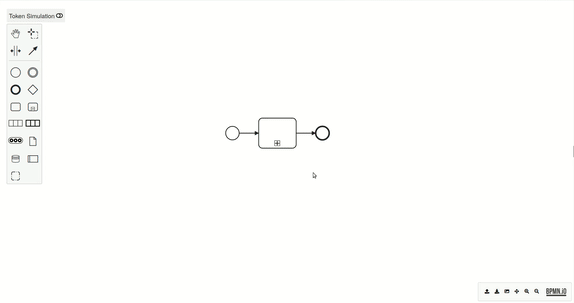

# bpmn-js SubProcess Importer

This [bpmn-js](https://github.com/bpmn-io/bpmn-js) extension adds a *"Import into empty subprocess"* menu item into the popup menu of collapsed and empty subprocesses. This menu item allows to populate the subprocess with contents loaded from an external BPMN model file.




## Use Extension

Extend your BPMN modeler with the module:

```javascript
import BpmnModeler from 'bpmn-js/lib/Modeler';

import SubProcessImporterModule from 'bpmn-js-subprocess-importer';

const modeler = new BpmnModeler({
  additionalModules: [
    SubProcessImporterModule
  ]
});
```

## License

MIT licensed

Copyright (C) 2024 Asvin Goel
